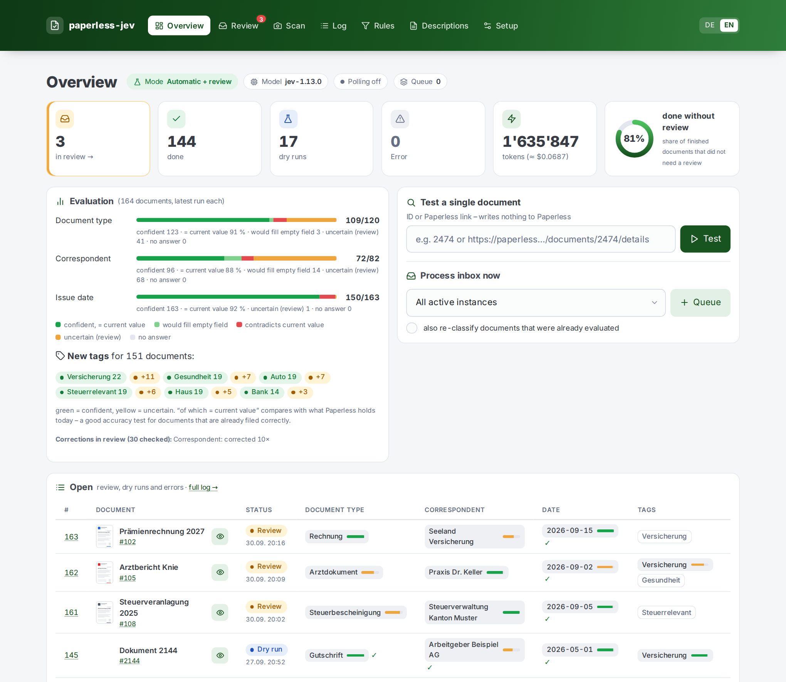
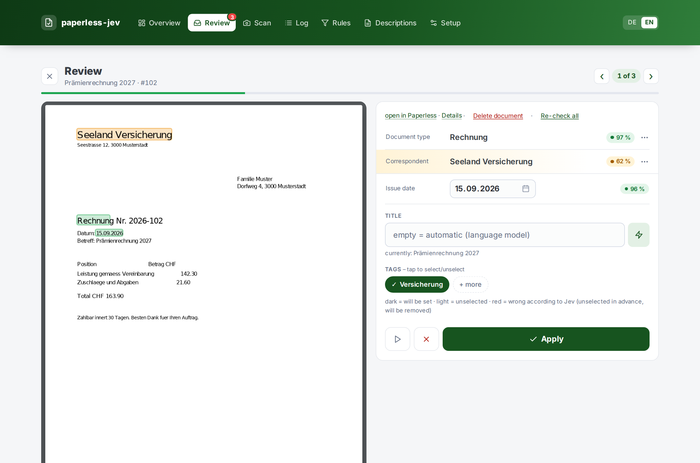
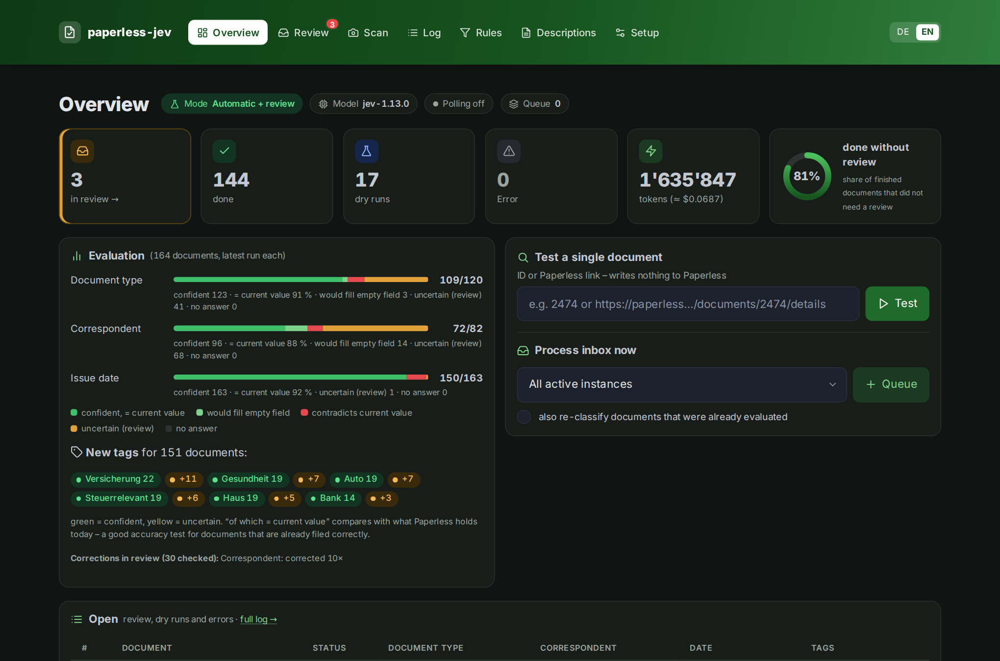
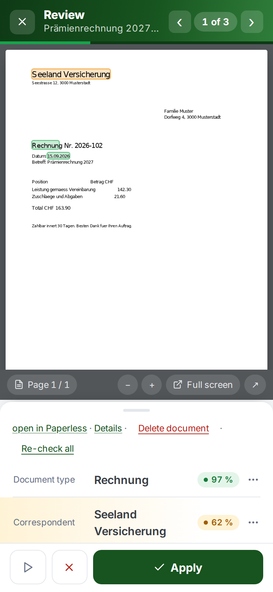
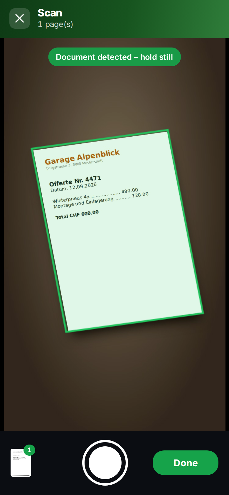
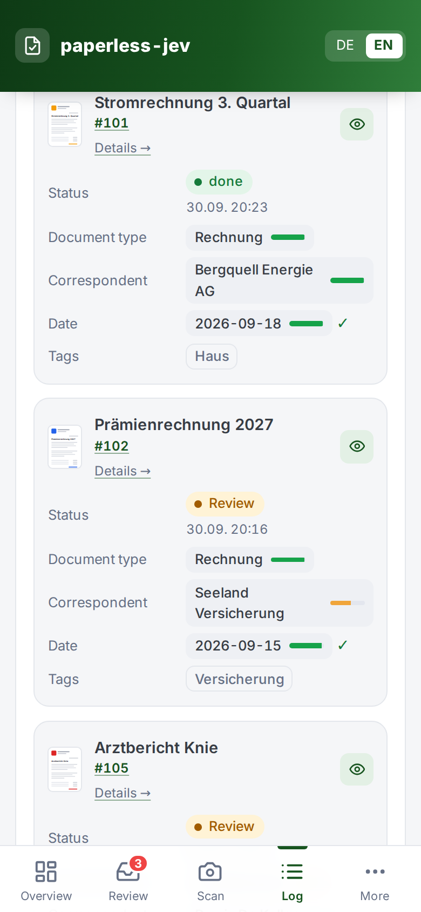
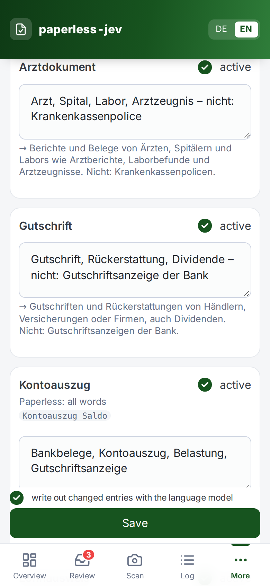
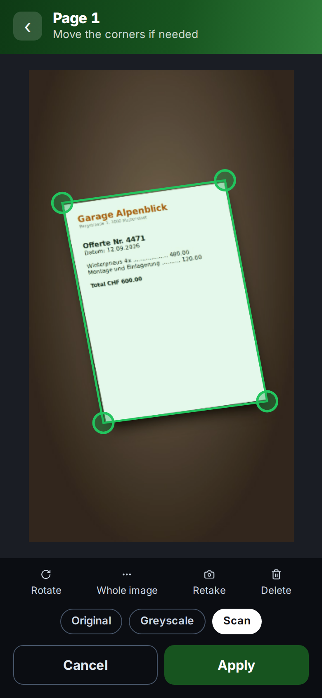
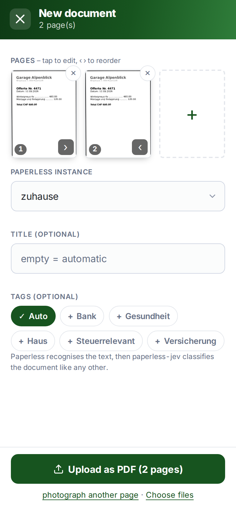
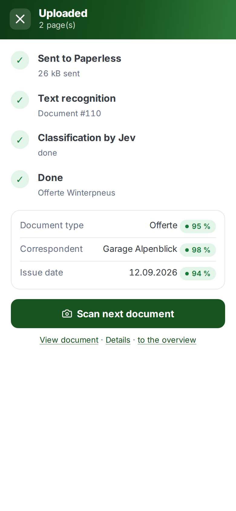

# paperless-jev

[Deutsch](README.md) · **English**

Classifies new documents in the [Paperless-ngx](https://docs.paperless-ngx.com/) inbox with
[TypeSafe Jev](https://docs.typesafe.ai/introduction): document type, correspondent, storage path,
issue date and tags. Runs as a Docker container and is configured entirely through a web UI.



| Review (desktop) | Dark mode |
|---|---|
|  |  |

| Review (phone) | Scan (phone) | Log (phone) | Descriptions (phone) |
|---|---|---|---|
|  |  |  |  |

<sub>Screenshots with made-up demo data, see [`demo/`](demo/).</sub>

## Features

- **Classification with confidence** – Jev chooses from your existing Paperless metadata and returns a
  calibrated confidence for every answer. Confident values are applied, uncertain ones go to review.
- **Three modes** – *dry run* (log only), *suggestions only* (everything to review) and
  *automatic* (apply confident values, the rest to review).
- **Review** one document at a time: the PDF right in the review with Jev's values highlighted, corrections with
  a tap, built for phones. Re-check all after configuration changes, delete documents (trash).
- **Double-check** – Jev also checks tags and values that are already set. Contradictions go to review or are
  corrected directly above a configurable confidence.
- **Single test** – check one document by ID or Paperless link without writing anything.
- **Evaluation** on the overview: hit rate per field compared with your current filing.
- **Descriptions from keywords** – a local language model (Ollama or OpenAI-compatible, e.g. Qwen)
  turns your keywords into a full description in the interface language.
- **Scan documents** with your phone: edges detected and straightened automatically, several pages into one PDF,
  straight to Paperless (see below).
- **Titles** optionally by language model (in the style of documents already filed, checked and shortened if
  needed) or by template; "Suggest title" previews it.
- **Filing conventions** – titles of documents already filed are sent to Jev as examples.
- **Log** with filters by document type, correspondent and tag, open entries by default, cleanup.
- **Webhook and polling**, multiple Paperless instances, Paperless-ngx 2.x and 3.x.
- **Interface** in German and English, optimised for phones, automatic dark mode.

## Scan documents with your phone

Paperless has no phone scanner of its own – paperless-jev brings one. Under **Scan** you photograph documents
right in the browser, multi-page ones included:

| ① Photograph | ② Check edges | ③ Pages &amp; upload | ④ Status |
|---|---|---|---|
|  |  |  |  |

1. **Photograph** – the document is detected live (green frame); take one page after another.
2. **Check edges** – the page is straightened in perspective; move the corners if needed, rotate, choose the
   filter *Original*, *Greyscale* or *Scan* (shadows evened out, high contrast for text recognition).
3. **Upload** – reorder pages, pick the instance, optionally title and tags; all pages go to Paperless as **one PDF**.
   Ready-made PDFs (e.g. iOS "Scan Documents") can be uploaded too.
4. **Status** – text recognition in Paperless, then paperless-jev classifies right away; the result appears directly.

Requirements: the page is served over **HTTPS** (camera in the browser), and a `Permissions-Policy` header from the
reverse proxy does not block the camera (`camera=(self)`). Edge detection (OpenCV.js, ~10 MB) is loaded on the first
camera start and cached afterwards.

## How it works

```
Paperless-ngx ──webhook "document added"──▶ paperless-jev ──▶ TypeSafe Jev
      ▲              (or polling)               │
      └──────── REST: read document, set values ┘
```

Jev does not generate text, it **chooses**: from your metadata, or from dates that the code found in the
OCR text beforehand. Each document is sent to Jev as **one** request containing all questions.

| Confidence | Action (*automatic* mode) |
|---|---|
| ≥ auto threshold | value is set in Paperless directly |
| ≥ review threshold | suggestion in the review queue (tag `ai-review`) |
| below | ignored |

## Quick start

Ready-made image (amd64 and arm64):

```bash
docker run -d --name paperless-jev -p 8090:8000 -v paperless-jev-data:/data \
  ghcr.io/pendraga/paperless-jev:latest
# → http://localhost:8090
```

Or build it yourself:

```bash
git clone https://github.com/PenDraga/paperless-jev.git
cd paperless-jev
cp .env.example .env
docker compose up -d --build
```

1. **Setup** – enter your TypeSafe API key, add a Paperless instance with URL and API token, "Test connection".
2. **Rules** – start in *dry run* mode, choose fields and thresholds, optionally set up a language model.
3. **Descriptions** – add a few keywords for document types and tags, especially to separate similar
   categories ("… – not: …").
4. **Overview → Process inbox now** and check the log to see how good the suggestions are.
5. Then switch to *automatic* mode and create the webhook in Paperless (see below).

### Environment variables

Everything else is configured in the web UI. The environment only covers:

| Variable | Default | Purpose |
|---|---|---|
| `PJ_SECRET_KEY` | – | Key for encrypting stored tokens. If unset, `/data/secret.key` is created. |
| `PJ_ADMIN_USER` / `PJ_ADMIN_PASSWORD` | `admin` / – | Optional basic auth for the web UI (`/hook/*` and `/health` stay open). |
| `PJ_LOG_LEVEL` | `INFO` | Log level |
| `PJ_DATA_DIR` | `/data` | Data directory (SQLite, key) |
| `TZ` | `Europe/Zurich` | Time zone for display |

**Back up `/data`** – `paperless-jev.db` and `secret.key` belong together, otherwise the stored tokens can no longer be read.

### Running behind Traefik

Example: [`deploy/compose.yaml`](deploy/compose.yaml) – in the same network as Paperless, web UI reachable
from the internal network only (IP allowlist). Note: a headers middleware with `frameDeny: true`
(`X-Frame-Options: DENY`) blocks the document viewer. paperless-jev sends
`X-Frame-Options: SAMEORIGIN` itself, so a middleware without `frameDeny` is enough. For scanning, a `Permissions-Policy` header must not block the camera (`camera=(self)` instead of `camera=()`), and the page must be served over HTTPS.

### Webhook in Paperless

Paperless (≥ 2.14) → *Workflows* → new workflow:

- Trigger *Document added*
- Action *Webhook*: `http://paperless-jev:8000/hook/<instance name>?token=<secret>` (secret on the setup page),
  *Use webhook parameters* enabled, parameter `doc_id` = `{{ doc_id }}`

Polling (every 5 minutes by default) stays active as a fallback and only processes inbox documents that
have never been evaluated.

## Privacy and cost

- The shortened OCR text and the names of your metadata are sent to `api.typesafe.ai`. According to its
  documentation, TypeSafe does not train on customer data. Documents tagged `ai-ignorieren` are never sent.
- The optional language model runs on your own hardware (Ollama, SGLang, vLLM, LM Studio …).
- jev-1.13 costs USD 0.042 per million input tokens. A document takes roughly 5–15k tokens, depending on
  the number of tags and examples, i.e. less than USD 0.001. The overview shows the total.

## Command-line dry run

Writes nothing to Paperless and shows suggestion, confidence and current value per document:

```bash
docker run --rm -it --network <paperless network> \
  -e PAPERLESS_URL=http://paperless:8000 -e PAPERLESS_TOKEN=... -e TYPESAFE_API_KEY=... \
  paperless-jev:latest paperless-jev-spike --sample 50 --blind
```

`--blind` hides the current filing and compares the suggestions with it. Descriptions can be tested
beforehand with `--descriptions`, template: [`beschreibungen.beispiel.json`](beschreibungen.beispiel.json).

## Development

```bash
pip install -e '.[dev]'
pytest
PJ_DATA_DIR=./data paperless-jev
```

Architecture, design decisions and measurements: [DOCUMENTATION.md](DOCUMENTATION.md).

## License

[MIT](LICENSE)
