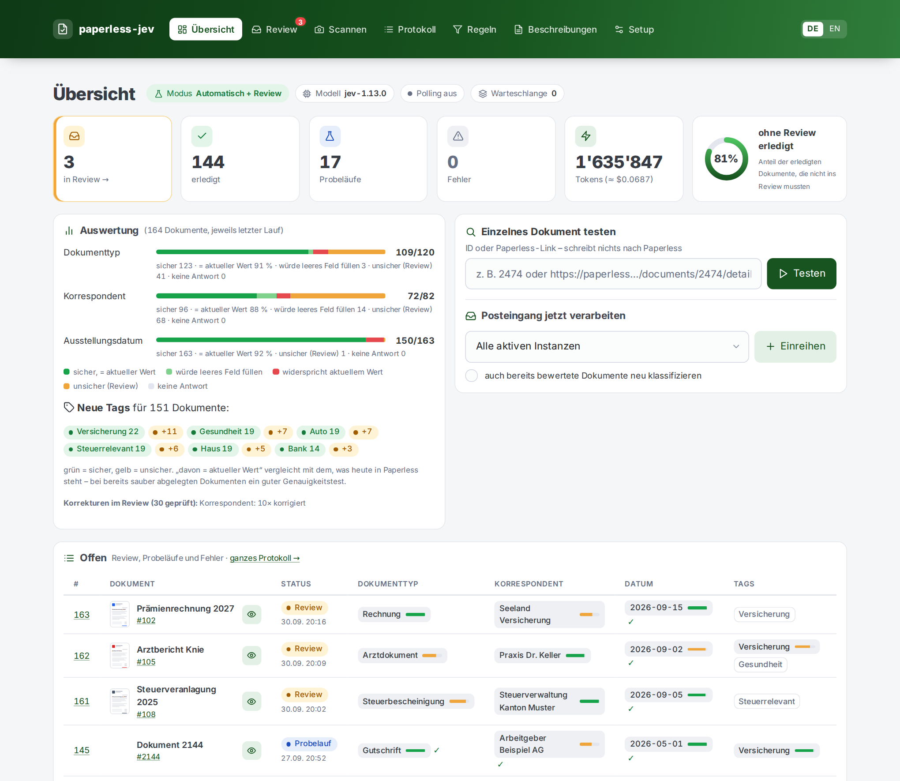
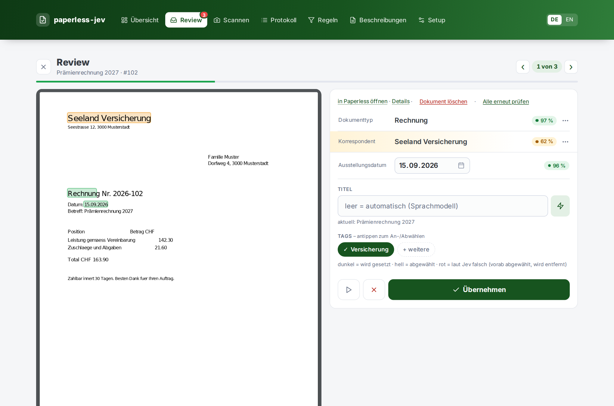
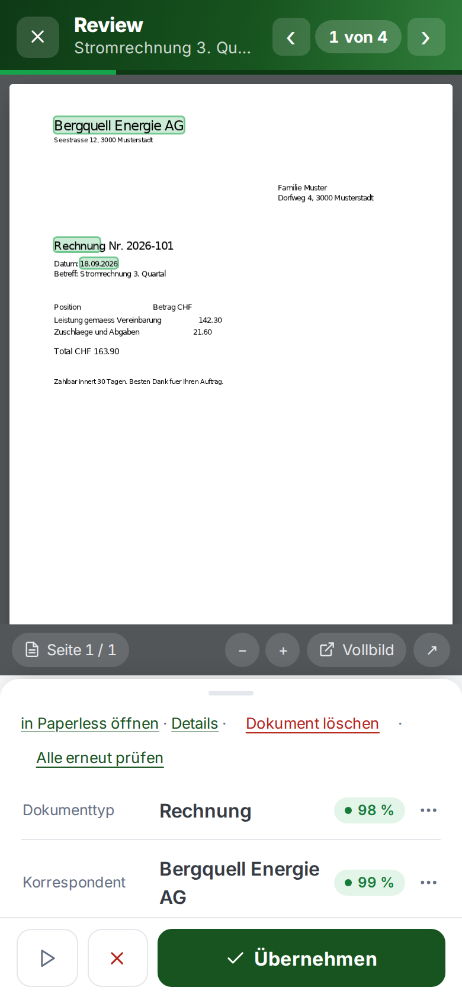
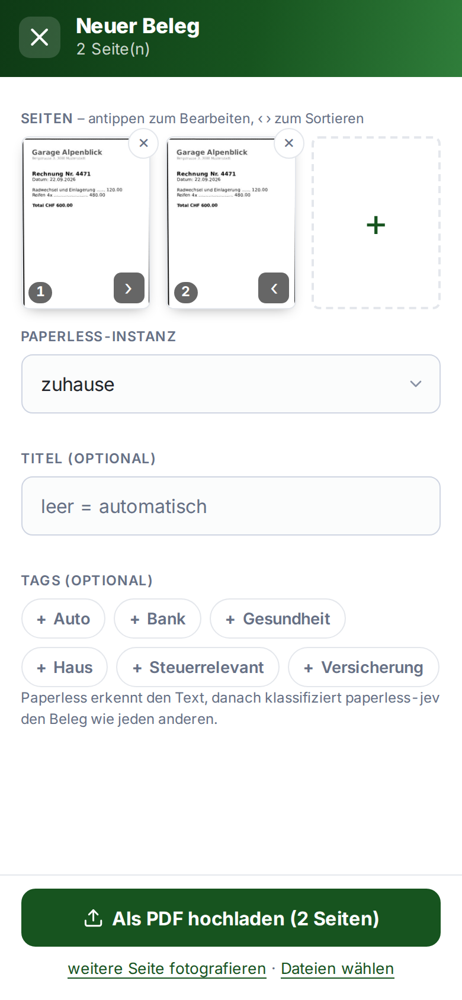
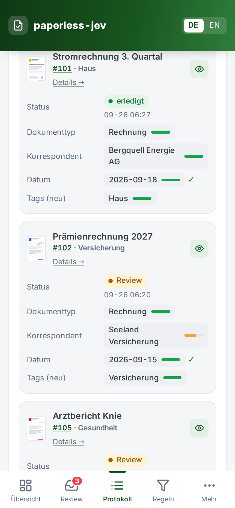
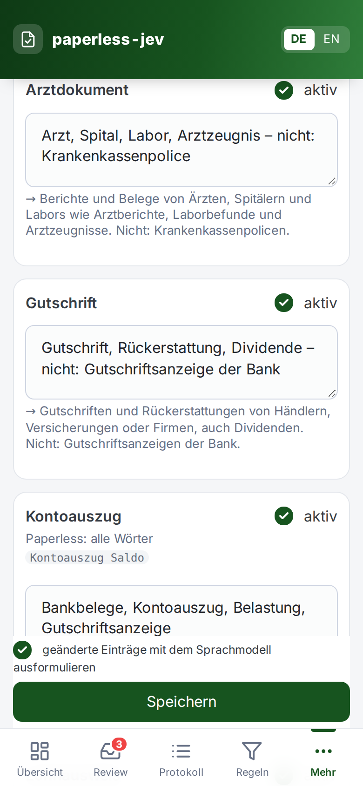
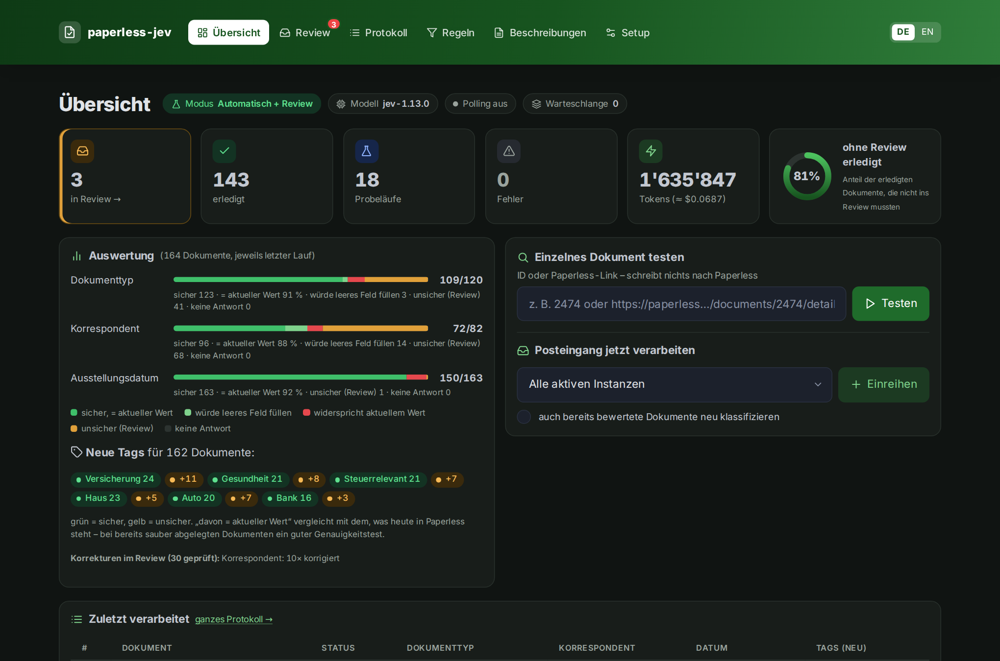

# paperless-jev

**Deutsch** · [English](README.en.md)

Klassifiziert neue Dokumente im [Paperless-ngx](https://docs.paperless-ngx.com/)-Posteingang mit
[TypeSafe Jev](https://docs.typesafe.ai/introduction): Dokumenttyp, Korrespondent, Speicherpfad,
Ausstellungsdatum und Tags. Läuft als Docker-Container und wird komplett über eine Web-UI eingerichtet.



| Review | Review (Handy) | Scannen (Handy) | Protokoll (Handy) | Beschreibungen (Handy) | Dark Mode |
|---|---|---|---|---|---|
|  |  |  |  |  |  |

<sub>Screenshots mit erfundenen Demodaten, siehe [`demo/`](demo/).</sub>

## Funktionen

- **Klassifizierung mit Confidence** – Jev wählt aus deinen vorhandenen Paperless-Stammdaten und liefert
  zu jeder Antwort eine kalibrierte Sicherheit. Sichere Werte werden gesetzt, unsichere landen im Review.
- **Drei Modi** – *Probelauf* (nur protokollieren), *Nur Vorschläge* (alles ins Review) und
  *Automatisch* (sichere Werte setzen, Rest ins Review).
- **Review** Dokument für Dokument: PDF direkt im Review mit markierten Jev-Werten, Korrektur per Antippen, fürs Handy gemacht.
- **Einzeltest** – ein Dokument per ID oder Paperless-Link prüfen, ohne etwas zu schreiben.
- **Auswertung** auf der Übersicht: Trefferquote je Feld im Vergleich zur heutigen Ablage.
- **Beschreibungen aus Stichworten** – ein lokales Sprachmodell (Ollama oder OpenAI-kompatibel,
  z. B. Qwen) formuliert deine Stichworte in der Sprache der Oberfläche aus.
- **Belege scannen** mit dem Handy: Rand wird automatisch erkannt und entzerrt, mehrere Seiten zu einem PDF, direkt nach Paperless.
- **Titel** optional per Sprachmodell (Stil nach bereits abgelegten Dokumenten) oder per Vorlage.
- **Ablage-Konventionen** – Titel bereits abgelegter Dokumente gehen als Beispiele an Jev.
- **Webhook und Polling**, mehrere Paperless-Instanzen, Protokoll mit Bereinigen.
- **Oberfläche** auf Deutsch und Englisch, fürs Handy optimiert, Dark Mode automatisch.

## So funktioniert es

```
Paperless-ngx ──Webhook "Dokument hinzugefügt"──▶ paperless-jev ──▶ TypeSafe Jev
      ▲                  (oder Polling)               │
      └──────────── REST: Dokument lesen, Werte setzen ┘
```

Jev erzeugt keinen Text, es **wählt aus**: aus deinen Stammdaten bzw. aus Datumsangaben, die der Code
vorher im OCR-Text gefunden hat. Pro Dokument geht **eine** Anfrage mit allen Fragen an Jev.

| Confidence | Aktion (Modus *Automatisch*) |
|---|---|
| ≥ Auto-Schwelle | Wert wird direkt in Paperless gesetzt |
| ≥ Review-Schwelle | Vorschlag in der Review-Queue (Tag `ai-review`) |
| darunter | ignoriert |

## Schnellstart

Fertiges Image (amd64 und arm64):

```bash
docker run -d --name paperless-jev -p 8090:8000 -v paperless-jev-data:/data \
  ghcr.io/pendraga/paperless-jev:latest
# → http://localhost:8090
```

Oder selbst bauen:

```bash
git clone https://github.com/PenDraga/paperless-jev.git
cd paperless-jev
cp .env.example .env
docker compose up -d --build
```

1. **Setup** – TypeSafe-API-Key eintragen, Paperless-Instanz mit URL und API-Token anlegen, „Verbindung testen“.
2. **Regeln** – im Modus *Probelauf* starten, Felder und Schwellwerte wählen, optional ein Sprachmodell einrichten.
3. **Beschreibungen** – für Dokumenttypen und Tags ein paar Stichworte hinterlegen, vor allem zur Abgrenzung
   ähnlicher Kategorien („… – nicht: …“).
4. **Übersicht → Posteingang jetzt verarbeiten** und im Protokoll prüfen, wie gut die Vorschläge sind.
5. Danach Modus *Automatisch* aktivieren und in Paperless den Webhook anlegen (siehe unten).

### Umgebungsvariablen

Alles Fachliche wird in der Web-UI eingestellt. Per Umgebung gibt es nur:

| Variable | Standard | Zweck |
|---|---|---|
| `PJ_SECRET_KEY` | – | Schlüssel für die Verschlüsselung der gespeicherten Tokens. Ohne Angabe wird `/data/secret.key` erzeugt. |
| `PJ_ADMIN_USER` / `PJ_ADMIN_PASSWORD` | `admin` / – | Optionaler Basic-Auth-Schutz der Web-UI (`/hook/*` und `/health` bleiben offen). |
| `PJ_LOG_LEVEL` | `INFO` | Log-Level |
| `PJ_DATA_DIR` | `/data` | Datenverzeichnis (SQLite, Schlüssel) |
| `TZ` | `Europe/Zurich` | Zeitzone für die Anzeige |

**`/data` sichern** – `paperless-jev.db` und `secret.key` gehören zusammen, sonst sind die gespeicherten Tokens nicht mehr lesbar.

### Betrieb hinter Traefik

Beispiel: [`deploy/compose.yaml`](deploy/compose.yaml) – im selben Netz wie Paperless, Web-UI nur aus dem
internen Netz (IP-Allowlist). Wichtig: Eine Header-Middleware mit `frameDeny: true`
(`X-Frame-Options: DENY`) blockiert den Dokument-Viewer. paperless-jev setzt selbst
`X-Frame-Options: SAMEORIGIN`, eine Middleware ohne `frameDeny` genügt also.

### Webhook in Paperless

Paperless (≥ 2.14) → *Workflows* → neuer Workflow:

- Auslöser *Dokument hinzugefügt*
- Aktion *Webhook*: `http://paperless-jev:8000/hook/<instanzname>?token=<secret>` (Secret auf der Setup-Seite),
  *Webhook-Parameter verwenden* aktiv, Parameter `doc_id` = `{{ doc_id }}`

Polling (Standard alle 5 Minuten) bleibt als Fallback aktiv und verarbeitet nur Dokumente im Posteingang,
die noch nie bewertet wurden.

## Datenschutz und Kosten

- Der gekürzte OCR-Text und die Namen deiner Stammdaten gehen an `api.typesafe.ai`. TypeSafe trainiert laut
  Doku nicht auf Kundendaten. Dokumente mit dem Tag `ai-ignorieren` werden nie gesendet.
- Das optionale Sprachmodell läuft bei dir (Ollama, SGLang, vLLM, LM Studio …).
- jev-1.13 kostet 0.042 USD pro Mio. Input-Tokens. Ein Dokument liegt je nach Anzahl Tags und Beispielen
  bei grob 5–15k Tokens, also unter 0.001 USD. Die Übersicht zeigt die Summe.

## Probelauf auf der Kommandozeile

Schreibt nichts nach Paperless und zeigt pro Dokument Vorschlag, Confidence und aktuellen Wert:

```bash
docker run --rm -it --network <paperless-netz> \
  -e PAPERLESS_URL=http://paperless:8000 -e PAPERLESS_TOKEN=... -e TYPESAFE_API_KEY=... \
  paperless-jev:latest paperless-jev-spike --sample 50 --blind
```

`--blind` blendet die heutige Ablage aus und vergleicht die Vorschläge damit. Beschreibungen lassen sich
vorab mit `--descriptions` testen, Vorlage: [`beschreibungen.beispiel.json`](beschreibungen.beispiel.json).

## Entwicklung

```bash
pip install -e '.[dev]'
pytest
PJ_DATA_DIR=./data paperless-jev
```

Architektur, Designentscheidungen und Messungen: [DOKUMENTATION.md](DOKUMENTATION.md).

## Lizenz

[MIT](LICENSE)
